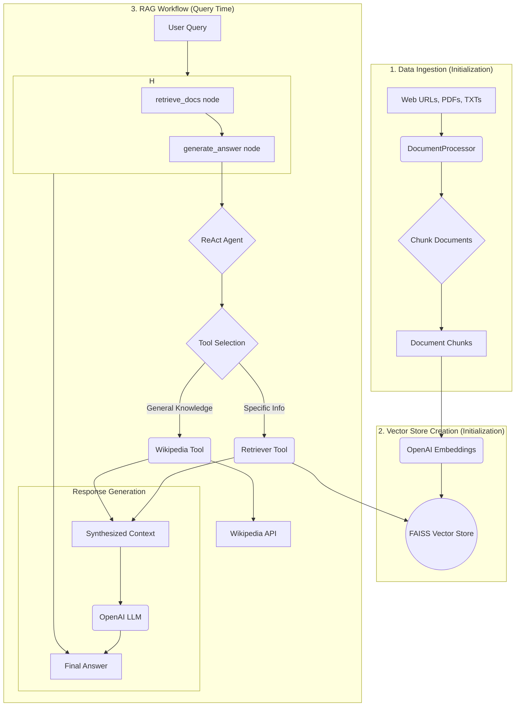

# 🔍 Agentic RAG-Based Question Answering System

This project implements an advanced Retrieval-Augmented Generation (RAG) system using LangChain, LangGraph, FAISS, OpenAI, and Streamlit. It goes beyond simple RAG by incorporating a ReAct agent that can dynamically choose between retrieving information from a vectorized document store or searching Wikipedia to provide more accurate and context-aware answers.

---

## 🚀 Features

-   **📄 Document Ingestion**: Load and process documents from various sources like web pages, PDFs, and text files.
-   **🧠 Embedding Generation**: Utilizes OpenAI's embedding models to create vector representations of document chunks.
-   **🗂️ Vector Storage**: Employs FAISS for efficient storage and retrieval of document embeddings.
-   **🤖 Agentic RAG with ReAct**: Implements a ReAct (Reasoning and Acting) agent that decides the best course of action:
    -   **Local Document Retrieval**: Searches the indexed documents for specific information.
    -   **Wikipedia Search**: Queries Wikipedia for general knowledge questions.
-   **🔗 LangGraph Workflow**: The entire process is orchestrated as a stateful graph using LangGraph, providing a clear and robust execution flow.
-   **🌐 Dual Interfaces**:
    -   An interactive and user-friendly web UI built with Streamlit.
    -   A command-line interface (CLI) for quick tests and interactions.
-   **🔧 Modular & MLOps-Friendly Design**: The codebase is organized into modular components, making it easy to extend, maintain, and integrate into MLOps pipelines.

---

## 🧱 Architecture Overview

The system is designed as a pipeline that starts from data ingestion and ends with generating an answer. The core of the system is a LangGraph-powered agent that intelligently routes requests.



### How it Works

1.  **Initialization**:
    *   **Document Ingestion**: The `DocumentProcessor` loads documents from specified sources (URLs, PDFs, etc.). These documents are then split into smaller, manageable chunks.
    *   **Vector Store Creation**: Each document chunk is passed through an OpenAI embedding model to create a numerical vector representation. These vectors are stored in a FAISS vector store, which allows for fast and efficient similarity searches.

2.  **Query Time**:
    *   **User Query**: The user asks a question through the Streamlit UI or the CLI.
    *   **Graph Execution**: The query is passed to the LangGraph-powered workflow.
    *   **Document Retrieval**: The `retrieve_docs` node performs an initial retrieval of relevant documents from the FAISS vector store.
    *   **Agentic Answer Generation**: The `generate_answer` node invokes a ReAct agent. This agent is equipped with two tools:
        1.  **Retriever Tool**: To look up information in the document store created at initialization.
        2.  **Wikipedia Tool**: To search for information on Wikipedia.
    *   **Tool Selection**: Based on the question, the ReAct agent decides which tool is more appropriate. For questions about the provided documents, it uses the retriever tool. For general knowledge questions, it uses the Wikipedia tool.
    *   **Response Generation**: The information gathered by the selected tool is used as context for an OpenAI LLM, which generates the final, human-readable answer.

---

## ⚙️ How to Use

### 1. Prerequisites

-   Python 3.8+
-   An OpenAI API key.

### 2. Setup

1.  **Clone the repository:**
    ```bash
    git clone <repository-url>
    cd <repository-directory>
    ```

2.  **Install dependencies:**
    ```bash
    pip install -r requirements.txt
    ```

3.  **Set up your environment:**
    -   Create a `.env` file in the root of the project.
    -   Add your OpenAI API key to the `.env` file:
        ```
        OPENAI_API_KEY="your-openai-api-key"
        ```

### 3. Running the Application

You can run the application in two ways:

**A. Streamlit Web UI (Recommended)**

To start the web interface, run:

```bash
streamlit run streamlit_app.py
```

The application will open in your browser. The system will initialize on the first run, which may take a minute.

**B. Command-Line Interface (CLI)**

To use the CLI, run:

```bash
python main.py
```

The script will run some example questions and then give you the option to enter an interactive mode to ask your own questions.

---

## 📂 Project Structure

```
├───data/                 # Data files (e.g., PDFs, TXTs for ingestion)
├───src/
│   ├───config/           # Configuration for the application (e.g., API keys, model names)
│   ├───document_ingestion/ # Document loading and processing logic
│   ├───graph_builder/    # LangGraph workflow construction
│   ├───node/             # Nodes for the LangGraph workflow (retrieval, generation)
│   ├───state/            # State definition for the LangGraph workflow
│   └───vectorstore/      # Vector store management (FAISS, OpenAI Embeddings)
├───main.py               # Entry point for the CLI application
├───streamlit_app.py      # Entry point for the Streamlit web UI
├───requirements.txt      # Python dependencies
├───README.md             # This file
└───.env                  # For storing environment variables (e.g., API keys)
```